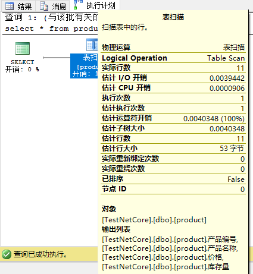

[TOC]

## 基础

#### 索引的概念

> 索引是按顺序排列的关键字列表，每个关键字旁边是一组页码，这些页码指向可在其中找到每个关键字的页面。

#### SqlServer索引概念

> 它是按顺序排列的`索引值`列表，每个`索引值`都有指向这些值所在的数据页面的指针，这些`索引值`，将构成索引页面，例如PDF文件的目录。
> 
> * 教室1 ————————————————  10页
>   
>   * 上午安排 ————————————— 11页
>     
>     * xx ——————————————  xx页
>       * xx ————————————  xx页
>   
>   * 下午安排 ————————————— 15页
> 
> * 教室2 ————————————————  20页
>   
>   * 上午安排 ————————————— 21页
>   * 下午安排 ————————————— 25页
> 
> 索引页面像这样的层级关系，该索引页面被称为索引的`根页`，为树结构的起始页面，包含实际数据指针的结束的页面称为`叶页`

#### SqlServer索引是什么？

SQL Server 索引是与表或视图关联的`磁盘上`或`内存中`结构，可以加快从表或视图中检索行的速度。 索引包含由表或视图中的一列或多列生成的键，对于在磁盘上索引，这些键将会以B树的方式存储

索引一般为`包含行和列`的表存储数据，在物理上按照一行一行存储（称为`行存储`），或以按列数据格式（称为`列存储`）存储数据 。

**关于如何选择合适的索引？**

答：在不影响数据库模式或应用程序设计的情况下添加、修改和删除索引，您应该毫不犹豫地尝试使用不同的索引。

**查看查询语句使用了哪个索引？**

打开`查询`菜单上选择`包括实际的执行计划`即可



#### 索引建立的先决条件

* 了解数据库本身的特征
  
  * 数据库是频繁修改数据的联机事务处理 (OLTP) 数据库，必须承受高吞吐量，这时候可以考虑内存化表和内存化表索引（先决条件：`SQL Server 2014 (12.x)`）
    
    > 关于内存化表：本质上，内存中 OLTP 通过提高数据访问和事务执行的效率和移除并发执行事务间的锁闩连接，来提升事务处理的性能：不是因为在内存中速度才快；而是因为内存中的数据得以优化速度才快。 数据存储、访问和处理算法经完全重新设计，以此来充分利用内存中和高并发计算的最新增强功能
    > 
    > 简单来说：内存化表将所有的IO操作替代为了内存中操作，这样写入数据时，少了许多操作，响应更快了
  
  * 数据库是一种决策支持系统 (DSS) 或数据仓库 (OLAP) 数据库，必须快速处理超大型数据集，这时候列存储索引尤其适合该应用场景
    
    > 列存储是在逻辑上整理为包含行和列的表，实际上以列式数据格式存储的数据。

* 了解最常用的查询的特征
  
  > 例如：了解到最常用的查询联接两个或多个表将有助于决定要使用的最佳索引类型

* 了解查询中使用的列的特征
  
  > 例如：一个列是含有整数数据类型同时还是唯一的或非空的列，对于这种具有定义完善的数据子集的列，尤其适合使用筛选索引（先决条件：`SQL Server 2008 和更高版本`）

* 确定在创建或维护索引时哪些索引选项可以提高性能
  
  > 例如：对某个现有大型表创建聚集索引将会受益于 `ONLINE` 索引选项
  > 
  > ONLINE选项允许在创建或重新构建索引时继续对底层数据进行并发活动

* 确定索引的最佳存储位置
  
  > 非聚集索引可以与表的物理文件存在一个磁盘中，也可以不存在一个磁盘中，如果将索引存储在一个固态硬盘上，那性能也将提升
  > 
  > 聚集索引和非聚集索引也可以使用跨越多个文件组的分区方案。 在维护整个集合的完整性时，使用分区可以快速而有效地访问或管理数据子集，从而使大型表或索引更易于管理
  > 
  > 在考虑分区时，应确定是否应对齐索引，即，是按实质上与表相同的方式进行分区，还是单独分区。

#### 建立索引时注意事项

##### 应遵守的数据库准则：

* 当一个表有大量索引时会影响`INSERT`、`UPDATE`、`DELETE` 和 `MERGE（合并操作）` 语句的性能，因为当表中的数据更改时，所有索引都须适当调整
  
  * 经常要更新的表，不要设置太多索引，并且保持索引涉及的列要少
  
  * 反之，大量的索引会提高查询（查询）语句的性能，因为查询优化器选择更多了
    
    > 查询优化器，执行T-SQL时内部会执行该方法寻找合适的索引去查询数据

* 数据量小的表完全可以不使用索引，因为数据量小时，遍历索引的时间 > 遍历整张表的时间

* 当查询视图需要联表或者使用聚合或者两者一起组合使用时，视图的索引可以显著地提升性能。 若要使查询优化器使用视图，并不一定非要在查询中显式引用该视图

建议：使用数据库引擎优化顾问来分析数据库并生成索引建议，[数据库引擎优化顾问](https://docs.microsoft.com/zh-cn/sql/relational-databases/performance/start-and-use-the-database-engine-tuning-advisor?view=sql-server-ver15)

##### 应遵守的查询准则

* 为经常用于查询中的谓词和联接条件的列创建非聚集索引，但是，应避免添加不必要的列。 
  
  > 添加太多索引列可能对磁盘空间和索引维护性能产生负面影响

* 涵盖索引可以提高查询性能，因为符合查询要求的全部数据都存在于索引本身中
  
  > 例如：对某一表（其中对列 **a** 、 **b** 和 **c** 创建了组合索引）的列 **a** 和 **b** 的查询，仅仅从该索引本身就可以检索指定数据，从而减少IO操作，

* 编写查询，在一条语句中插入或修改尽可能多的行，而不是使用多个查询来更新相同的行。只使用一条语句，就可以利用优化的索引维护。

* 评估查询类型以及如何在查询中使用列。 
  
  > 例如：在完全匹配查询类型中（也就是 col = 'value'）使用的列就适合用于非聚集索引或聚集索引。

##### 应遵守的列准则

* 对于聚集索引，请保持较短的索引键长度，并且最好是非空的或唯一的

* 无法指定 **ntext**、 **text**、 **image**、 **varchar(max)** 、 **nvarchar(max)** 和 **varbinary(max)** 数据类型的列为索引键列，不过， **varchar(max)** 、 **nvarchar(max)** 、 **varbinary(max)** 和 **xml** 数据类型的列可以作为非键索引列参与非聚集索引，即包含列扩展非聚集索引
  
  > 非聚集索引文件中有讲解包含列扩展非聚集索引，搜索关键字`包含列扩展非聚集索引`即可
  > 
  > 非键列：未参与任何索引并且不是作为主外键出现的列

* **xml** 数据类型的列只能在 XML 索引中用作键列
  
  > SQL Server 2012 引入了称作选择性 XML 索引的一种新的 XML 索引，这个新的索引可提高 SQL Server 中针对作为 XML 存储的数据的查询性能，从而通过降低索引本身的存储成本来加快大型 XML 数据工作负荷的索引编制和改进可伸缩性

* 检查列的唯一性，可选择使用唯一索引，唯一索引有益于查询

* 在列中检查数据分布
  
  > 为包含很少唯一值的列创建索引或在这样的列上执行联接将导致长时间运行的查询
  > 
  > 例如：如果物理电话簿按姓的字母顺序排序，而城市里所有人的姓都是 Smith 或 Jones，则无法快速找到某个人

* 考虑对具有定义完善的子集的列（例如，稀疏列、大部分值为 NULL 的列、含各类值的列以及含不同范围的值的列）使用筛选索引。
  
  > 设计良好的筛选索引可以提高查询性能，降低索引维护成本和存储成本

* 如果索引包含多个列，则应考虑列的顺序。 用于等于 (=)、大于 (>)、小于 (<) 或 BETWEEN 搜索条件的 WHERE 子句或者参与联接的列应该放在最前面。 其他列应该基于其非重复级别进行排序
  
  > 就是说，从最不重复的列到最重复的列

* 考虑对计算列进行索引
  
  > 计算列是虚拟列，并非实际存储在表中，除非此列标记为 PERSISTED，计算列的表达式可以使用其他列中的数据来计算其所属列的值
  > 
  > 例：
  > 
  > ```sql
  > CREATE TABLE dbo.Products(
  > ProductID int IDENTITY (1,1) NOT NULL,
  > Qty-available smallint,
  > Unit-Price money,
  > Inventory-value AS Qty-available * Unit-Price
  > )
  > ```

##### 索引的特征

在确定某一索引适合某一查询之后，可以选择最适合具体情况的索引类型

- 聚集还是非聚集
- 唯一还是非唯一
- 单列还是多列
- 索引中的列是升序排序还是降序排序
- 非聚集索引是全表还是经过筛选
- 列存储与行存储
- 内存优化表的哈希索引与非聚集索引

您也可以通过设置选项（例如 FILLFACTOR）自定义索引的初始存储特征以优化其性能或维护，通过使用文件组或分区方案可以确定索引存储位置来优化性能

##### 文件组或分区方案的索引设置

开发索引设计策略时，应该考虑在与数据库相关联的文件组上放置索引。 仔细选择文件组或分区方案可以改进查询性能

默认情况下，索引存储在索引表的文件组上，可以通过以下方式改变

- 为除基表或聚集索引的文件组之外的文件组创建非聚集索引。
- 对要涵盖多个文件组的聚集和非聚集索引进行分区。
- 通过删除聚集索引并在 DROP INDEX 语句的 MOVE TO 子句中指定新的文件组或分区方案，或者在 CREATE INDEX 语句中使用 DROP_EXISTING 子句，将表从一个文件组移至另一个文件组。

做这些操作，为的就是可以同时读取多个文件组，并行任务

##### 在多个文件组中分区

可以考虑在多个文件组中对聚集索引和非聚集索引分区，根据分区函数，对已分区的索引进行**水平分区**或**按行分区**。

分区函数定义如何根据某些列（称为分区依据列）的值将每一行映射到一组分区。 分区方案将分区映射指定给一组文件组。

对索引进行分区有以下优点：

- 提供使大型索引更易管理的可伸缩系统。
- 使查询运行得更快、更有效。 当查询访问索引的几个分区时，查询优化器同时可以处理各个分区，但不包括不受该查询影响的分区。

##### 索引优化 order by

在 create index/table 或 alter table 的语法上可以为索引或约束中的列上添加 asc/desc

当没有排序规则时，查询出来的内容如果是与原顺序相反的将会触发**Sort**查询计划，该计划会影响查询效率，所以我们可以在索引上或约束上添加排序规则

```sql
CREATE NONCLUSTERED INDEX IX_PurchaseOrderDetail_RejectedQty  
ON Purchasing.PurchaseOrderDetail  
    (RejectedQty DESC, ProductID ASC, DueDate, OrderQty);  
```

创建该索引后一下两个方法都可以使用该索引

```sql
SELECT RejectedQty, ((RejectedQty/OrderQty)*100) AS RejectionRate,  
    ProductID, DueDate  
FROM Purchasing.PurchaseOrderDetail  
ORDER BY RejectedQty DESC, ProductID ASC;
-- 或者
ORDER BY RejectedQty asc, ProductID desc;  
```
